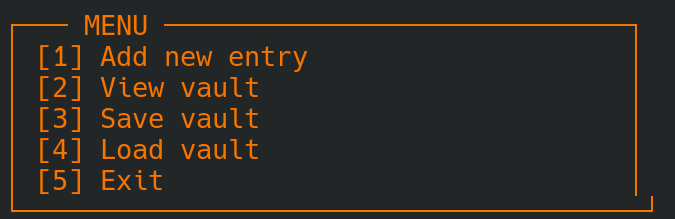

# VAULT

---

###  Description

**Vault** is a lightweight, local, ASCII-based password manager written in pure **C++**.  tbh: I made  it bcs I needed a system to store github tokens
It uses a **Caesar cipher** to encrypt passwords and stores them safely in a local file (`vault.dat`).  
The project is fully terminal-based and designed for simplicity.

---

##  Current Look

